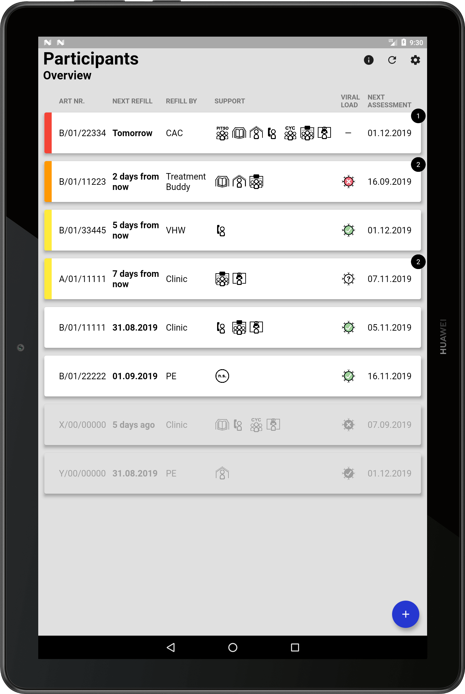

[](https://travis-ci.org/chrisly-bear/PEBRApp)
[](https://codecov.io/gh/chrisly-bear/PEBRApp)
[](https://github.com/chrisly-bear/PEBRApp/blob/master/LICENSE)

# PEBRApp


Developed with ❤️ by [Tech4All](https://techforall.co.ls) Maseru, Lesotho & [Christoph Schwizer](https://schwizer.dev) Zurich, Switzerland.

Mobile application for the PEBRA trial. The PEBRA ("Peer-Educator Based Refill of ART") trial is part of the GET ON IT research project of the [Swiss Tropical and Public Health Institute](https://www.swisstph.ch/en/projects/hiv-care-research-in-lesotho/) and tries to work towards the [UNAIDS 90-90-90](https://www.unaids.org/en/resources/909090) targets among adolescents and young adults with HIV in rural Lesotho. The app helps peer educators keep track of their interactions with study participants and acts as a data gathering tool for the study. The user interface is designed specifically for the Huawei MediaPad T5, the device used in the study. Deploying to devices with other screen sizes might work but is not officially supported at this point.



## Configure

The app interacts with two online services: (1) [VisibleImpact](https://visibleimpact.org) for fetching and uploading patient-related data and (2) [PEBRAcloud](https://github.com/chrisly-bear/PEBRAcloud) for user account management and backups. You need to configure these two services in `lib/config/VisibleImpactConfig.dart` and `lib/config/PebraCloudConfig.dart`, respectively.

## Build and Run

The app is built with Flutter, Google's cross-platform UI toolkit. To build and run the app, you need to have the Flutter SDK installed (see https://flutter.dev/docs/get-started/install). Then run the app with:

```bash
flutter run
```

If you want to specify a device to run the app on (check devices with `flutter devices`) use the `-d` argument:

```bash
# runs the app on the Android emulator with ID 5554
flutter run -d emulator-5554
```

### Flutter Version & FVM

You should use the Flutter version defined in `.fvm/fvm_config.json`. To install a specific version of Flutter, it is recommended to use **Flutter Version Management** (https://fvm.app).

## Release

To make a deployable apk file, simply run:

```bash
flutter build apk
```

You may want to follow the steps at https://flutter.dev/docs/deployment/android#signing-the-app to create a signed apk. Also, to reduce the size of the apk, you can build it specifically for one architecture (such as ARM) by running:

```bash
# creates a smaller apk which runs on ARM devices only
flutter build apk --target-platform android-arm --split-per-abi
```

You can build for other target platforms by using one (or several) of `android-arm64`, `android-x86`, `android-x64` as the `--target-platform` parameter.

## License

This project is licensed under the MIT license (see the [LICENSE](LICENSE) file for more information).

The app logo and some of the icons used in the app (icons for support options and viral load status) are exempt from this license and are **under copyright by their creators**. See the respective COPYRIGHT notice under [assets/logo/COPYRIGHT](assets/logo/COPYRIGHT) and [assets/icons/COPYRIGHT](assets/icons/COPYRIGHT).
